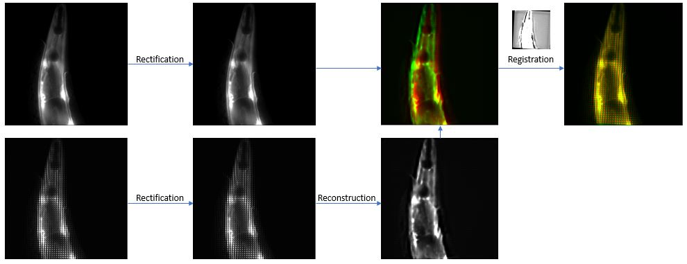
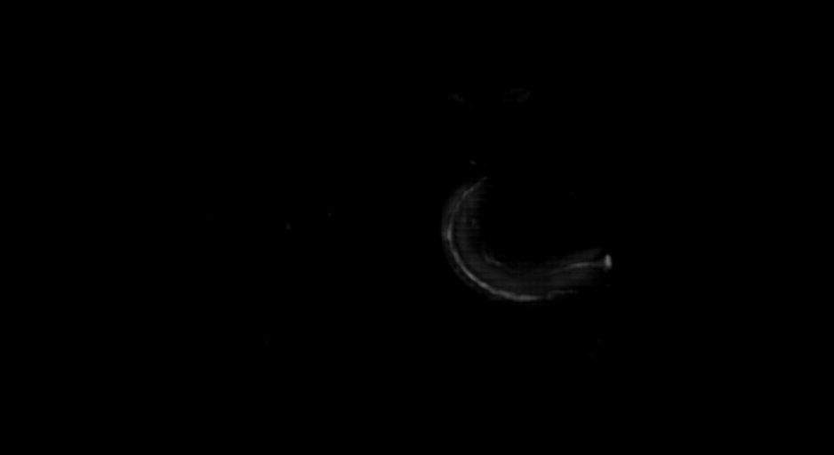

# Deep-learning-for-Light-Field-Microscopy 

Deep learning toolbox for excitation-free bioluminescence imaging

## Overview
EFµ is a toolbox for the implementation of Deep Learning pipelines to bioluminescent microscopy imaging [1]. This includes the use of common deep learning tasks such as denoising to the reconstruction of 3D bioluminescent scenes using light field microscopy. Scripts, models, and environments are provided in this repository to facilitate the run of the experiments.

## Getting started

### Create environments
Use the yaml files deposited in EFµ/Environments/ with [anaconda](https://www.anaconda.com/) to download the python packages needed to run the models. Run the next command in a terminal or an Anaconda prompt to create the environment from the yml file. 

```
conda env create -f environment.yml

```
Use `conda env list` to verify the environment was installed correctly. Read [here](https://docs.conda.io/projects/conda/en/latest/user-guide/tasks/manage-environments.html#creating-an-environment-from-an-environment-yml-file) for more info.

## Prepare datasets
Before training, preprocessing must be done for the pipelines to work properly. Please read the following instructions for each case.

### Rectification
We performed data rectification using the software provided [here](https://www.nature.com/articles/nmeth.2964) [2]. To rectify multiple stacks and images without having to use the GUI, we wrote a small script for the sequential rectification of multiple images using the same parameters (coming from the same setup). Download the indicated software and paste the scripts into the MatLab working space. These will be used in the preparation of experimental data for light field reconstruction. You can use [LFDisplay](http://graphics.stanford.edu/software/LFDisplay/) software to find the right optical properties for your images.

### Dualview denoising model
Configure the script _Dual_view_splitData.py_ with the respective directories where your raw data is stored. Modify the writing paths to save the processed data. To run the script, type in the terminal `python dataprep/Dual_view_splitData.py`.

### Denoising bioluminescent light field images
Use the script _Organize_dataset.py_ to generate the bioluminescent training pairs. In our case, the highest exposure times were 5 and 10 seconds. This script will look up for the highest exposure in every stack subfolder and pair it with the rest of conditions. In other words, if you acquired bioluminescent images with conditions: 100 ms, 200 ms, 1 sec, 5 sec and 10 sec, the script will match each frame of the 100 ms stack with their corresponding slice in the 10 sec condition. The same process will be done for the rest of exposures. To use it, configure the paths accordingly to your case and use the command `python dataprep/Denoising_biolum_LF.py`.

### Light field reconstruction: Synthetic dataset
The generation of synthetic data was made by following the pipeline from [[2]](https://www.nature.com/articles/nmeth.2964) and [[3]](https://www.nature.com/articles/s41592-021-01058-x). First, compute the PSF using your MLA properties and magnification/NA of your objective, see [supplementary software](https://www.nature.com/articles/nmeth.2964). Next, use [data preparation software](https://github.com/feilab-hust/VCD-Net/tree/main/datapre) to perform the synthetic light field forward projection and data augmentation.

### Light field reconstruction: Experimental dataset
This script has multiple steps and has a few prerequisites. We expect you to have the experimental fluorescent light field image with its corresponding epifluorescent image, a model already trained with synthetic data (see the previous subsection) and,  a recent [matlab](https://es.mathworks.com/products/matlab.html) license installed in your current workstation. The script will extract the information from raw stacks and generate well-aligned train patches ready for training. To run the script from scratch, add the directories from your data, set variables to **True**, and select the desired patch size for training:

```
day = "20220413" #Name of the root folder where all data is contained (day the data was taken)
mkdirs = True #Create directories to save the multiple sted data
Get_img = True #Extract the images from the stacks and pair it with their corresponding GT
rectification_ = True #Rectify single LF images, stacks and middle plane
patch_size = 256 #Final patch size

reconstruction_ = True #Set True for perform LF reconstruction
use_cpu = 0 #0 to use GPU, 1 to use CPU (for inference)
register_ = True #Set true to register LF images witht the stacks
patchify_ = True #Set True if you want to generate patches
```
For the reconstruction select the model you will use by setting these variables to their corresponding paths:
```
path_r_pred = r"" #Source of the data to predict (directory)
model_name = "" #Name of the checkpoint model
```

The paired patches will be saved in the directory you set with the variable name `path_root`. Here is a small sketch of the whole process


To run the script, use the following command `python dataprep/Create_dataset_exp_LF.py`

## Training
All training was based on the open-source [4](https://github.com/CSBDeep/CSBDeep) and [3](https://github.com/feilab-hust/VCD-Net/tree/main/vcdnet). Please follow the links for more information.

### Denoising
All denoising models were trained using the CARE (2D) denoising pipelines [4](https://www.nature.com/articles/s41592-018-0216-7) (except for the bioluminescent zebrafish embryo). After activating the environment _CAREv2_ using the following command `conda activate CAREv2`, you can either open the jupyter-notebook _CAREv2.ipynb_ (notebook based on the work of [5](https://github.com/HenriquesLab/ZeroCostDL4Mic/wiki)) to see more details about the training (display the extracted patches, etc) or run directly the script `python Train_Care2D.py`.

### Light field reconstruction
All light field reconstruction models were trained using the VCDNet pipelines [[Wang et. al.]](https://www.nature.com/articles/s41592-021-01058-x). Therefore, the code can be found [here](https://github.com/feilab-hust/VCD-Net/tree/main/vcdnet)[3]. After activating the environment _tf1.15py3.6_ using the following command `conda activate tf1.15py3.6`, you need to change accordingly the training configuration in the file _config.py_. After this, run `python train.py` script to train a new model. You can also use the `jupyter-notebook TRAIN.py` command for the training and configuration of the network. The models will be saved in the checkpoint directory (check the _config.py_ file).

## Inference
After training a model for a considerable amount of epochs, you can use the model checkpoint to predict files that were not present in the training dataset.

### Denoising inference
To make a prediction using the denoising CARE2D pipeline, use the script _Predict_2D_denoising.py_, first change the variables `Test_data_folder` and `Result_folder_root` to your the directories where the noisy images are stored and the cleaned images will be stored respectively. Then use the python list `models` to list all the models you want to use, for example `models = ["name_model1", "name_model2", "name_model3", "name_model4" ...]` and set the variable `inference_model_path` where your models are stored. Next, run the following command `python Predict_2D_denoising.py`

For the zebrafish embryo, we made use of the projection and a denoising sub-network. Use `python Predict_projection_script.py --model_path "model_path" --to_predict "source_path" --prediction "pred_path"` to use the projection model. It will read the images saved in "source_path" and save the inference in the "pred_path".

### Light field reconstruction inference
To make a prediction using the 3D reconstruction VCDNet pipeline, use either the script _eval.py_ from the VCDNet repo or the _PREDICT.ipynb_ notebook listed here. Change the _config.py_ file according to the model you will use. Open the notebook using `jupyter-notebook PREDICT.ipynb` with the conda environment _tf1.15py3.6_

Use your trained denoising networks to restore the input of the light field reconstruction pipeline to achieve better restorations in high starve-photon samples. Remember to rectify your images before the 3D reconstruction.



## Inference quality

The most common metric to measure the quality of a model's reconstruction is the SSIM (A structural comparison. Value between 0 and 1, the better the closer to 1) and RSE (An intensity comparison. Value between 0 and 1, the better the closer to 0). Use the script _Denoising\Quality_control.py_ to predict and compute the metrics for each image. Set the variables `Source_QC_folder`, `Target_QC_folder`, `Result_folder`, and `QC_model_path` to the directory where your source images, GT images, inferences, and the checkpoint of your models respectively. You can use the name of several models `models = ["model1", "model2", "model3"]` for later model comparison.

## References

[1] Morales-Curiel, L. F., Castro-Olvera, G., Gonzalez, A., Lin, L., El-Quessny, M., Porta-de-la-Riva, M., Severino, J., Battle, L., Ramallo, D., Ruprech, V., Loza-Alvarez, P., & Krieg, M. (2022). Volumetric imaging of fast cellular dynamics with deep learning enhanced bioluminescence microscopy. Communications Biology, 5(1), 1330. doi:10.1038/s42003-022-04292-x

[2] Prevedel, R., Yoon, Y.-G., Hoffmann, M., Pak, N., Wetzstein, G., Kato, S., Schrödel, T., Raskar, R., Zimmer, M., Boyden, E. S., & Vaziri, A. (2014). Simultaneous whole-animal 3D imaging of neuronal activity using light-field microscopy. Nature Methods, 11(7), 727–730. doi:10.1038/nmeth.2964

[3] Wang, Z., Zhu, L., Zhang, H., Li, G., Yi, C., Li, Y., Yang, Y., Ding, Y., Zhen, M., Gao, S., Hsiai, T. K., & Fei, P. (2021). Real-time volumetric reconstruction of biological dynamics with light-field microscopy and deep learning. Nature Methods, 18(5), 551–556. doi:10.1038/s41592-021-01058-x

[4] Weigert, M., Schmidt, U., Boothe, T., Müller, A., Dibrov, A., Jain, A., Wilhelm, B., Schmidt, D., Broaddus, C., Culley, S., Rocha-Martins, M., Segovia-Miranda, F., Norden, C., Henriques, R., Zerial, M., Solimena, M., Rink, J., Tomancak, P., Royer, L., … Myers, E. W. (2018). Content-aware image restoration: pushing the limits of fluorescence microscopy. Nature Methods, 15(12), 1090–1097. doi:10.1038/s41592-018-0216-7

[5] Von-Chamier, L., Laine, R. F., Jukkala, J., Spahn, C., Krentzel, D., Nehme, E., Lerche, M., Hernández-Pérez, S., Mattila, P. K., Karinou, E., Holden, S., Solak, A. C., Krull, A., Buchholz, T. O., Jones, M. L., Royer, L. A., Leterrier, C., Shechtman, Y., Jug, F., … Henriques, R. (2021). Democratising deep learning for microscopy with ZeroCostDL4Mic. Nature Communications, 12(1), 2276. doi:10.1038/s41467-021-22518-0

